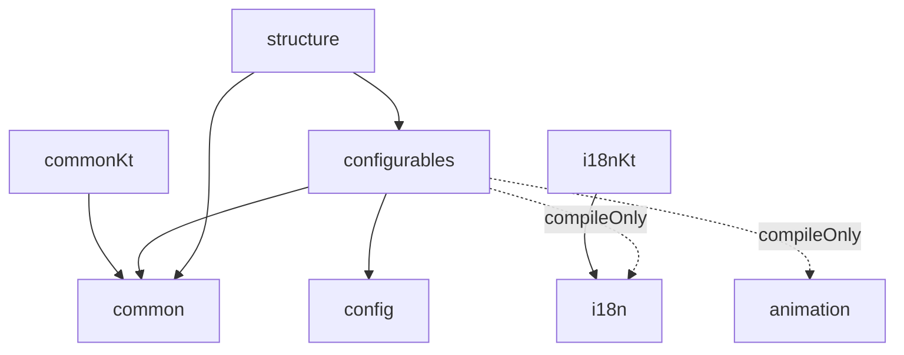

# WUtils project context

Shared briefing for the `wiki-writer` and `code-doc-writer` agents working in this repo.
Both agents must read this before starting.

## The two wikis

`docs/` holds two wikis with different readers, different rules, and separate indexes:

| Root | Reader | Style |
|---|---|---|
| `docs/dev/` | someone changing WUtils itself | internals, invariants, sharp edges, `File.java:42` citations, prose-only |
| `docs/user/` | someone using WUtils in their plugin | task-oriented, code examples, no citations |

`python3 .claude/validate-docs.py` enforces both sets of rules. Anyone writing
`docs/user/` must also read `.claude/user-doc-context.md`, which overrides the
`wiki-writer` agent definition.

## What WUtils is

A multi-module Gradle collection of independently versioned and independently published
Java/Kotlin libraries for **Bukkit/Paper 1.16.5** plugins. Each module is its own Maven
Central artifact under group `io.github.wyne10` (`wutils-common`, `wutils-i18n`, ...).
Consumers pull only the modules they need — WUtils is not a framework, it is a set of
reusable libraries. Java 16 source level. GPL-3.0. Repo: https://github.com/Wyne10/WUtils

## Modules

Gradle project names are `:WUtils-<name>`; directory names differ (see `settings.gradle`).

| Dir | Gradle project | Artifact | Version | What it does |
|---|---|---|---|---|
| `common/` | `:WUtils-common` | `wutils-common` | 1.16.5 | Shared toolkit: events, scheduling, promises, terminables, operations, particles, ranges, durations, comparators, plugin bootstrap, serialization |
| `commonKt/` | `:WUtils-common-kotlin` | `wutils-common-kotlin` | = common | Kotlin extensions/wrappers over `common` |
| `config/` | `:WUtils-config` | `wutils-config` | 2.10.1 | Annotation-based YAML config generation, updating and reading |
| `configurables/` | `:WUtils-configurables` | `wutils-configurables` | 1.21.8 | Predefined annotation-friendly config serializers (items, GUIs, animations, interactions) |
| `i18n/` | `:WUtils-i18n` | `wutils-i18n` | 5.6.1 | Internationalization: MiniMessage/Legacy/EnhancedLegacy interpreters, PlaceholderAPI, per-player languages, YAML/JSON/`.lang` sources |
| `i18nKt/` | `:WUtils-i18n-kotlin` | `wutils-i18n-kotlin` | = i18n | Kotlin extensions/wrappers over `i18n` |
| `animation/` | `:WUtils-animation` | `wutils-animation` | 2.2.3 | Sequential/parallel animation orchestration (particles, sounds, fireworks, titles) |
| `structure/` | `:WUtils-structure` | `wutils-structure` | 1.2.7 | Configurable schematic-based structure placement via WorldEdit/WorldGuard |
| `jdbc/` | `:WUtils-jdbc` | `wutils-jdbc` | 2.0.0 | Connection-pool abstraction (HikariCP, ORMLite) + runtime JDBC driver download |
| `json/` | `:WUtils-json` | `wutils-json` | 1.2.1 | Minimal annotation-driven Gson serialization |
| `log/` | — | — | 3.4.12 | **DEPRECATED.** Commented out of `settings.gradle`. Do not document. |

Every module's root package is `me.wyne.wutils.<something>` — note that `configurables`
lives under `me.wyne.wutils.config.configurables`, and `commonKt` under
`me.wyne.wutils.common.kotlin`.

## Inter-module dependencies

`config`, `i18n`, `animation`, `jdbc`, `json` have no WUtils dependencies.
Dotted edges are `compileOnly` — optional integrations the consumer opts into by
supplying the dependency themselves. The wiki must be explicit about which
integrations are optional, since a missing optional dep is a runtime failure mode.

Third-party integrations, all `compileOnly` (consumer supplies them): Paper API 1.16.5,
CommandAPI, PlaceholderAPI, Adventure/MiniMessage, EnhancedLegacyText, triumph-gui,
InvUI, WorldEdit, WorldGuard, HikariCP, ORMLite, Gson, log4j.

## Vendored code — do not document, link out instead

47 files in `common/` are vendored from **lucko's `helper`** library (MIT).
Identify them by the `This file is part of helper, licensed under the MIT License.`
header. They cover these `me.wyne.wutils.common` packages, wholly or partly:

`promise/`, `terminable/`, `terminable/composite/`, `terminable/module/`, `event/`,
`event/filter/`, `event/functional/**`, `scheduler/`, `scheduler/builder/`,
`scheduler/threadlock/`, `exception/`, `exception/types/`, `interfaces/Delegate.java`,
`Delegates.java`

Rules for both agents:

- **`code-doc-writer`: never edit a file carrying the helper header.**
- **`wiki-writer`: do not re-explain vendored APIs.** Give the package a short page or
  section stating that it is vendored from lucko's helper, what role it plays in WUtils,
  and link to the upstream wiki (https://github.com/lucko/helper/wiki) for the API
  itself. Do document any WUtils-specific additions or divergences you find alongside
  the vendored files.

Before documenting anything in `common/`, run
`grep -l 'part of helper' <file>` (or check the header) to classify it.

## Style facts to respect

- Existing JavaDoc is sparse — about 40 of 492 source files have any, and most of those
  are the vendored ones. Treat lucko's style as the house reference: imperative mood,
  `
` paragraph tags, `@param`/`@return` only when they add information.
- The `java` skill's "no JavaDoc unless asked" rule is overridden for `code-doc-writer`
  only. It still applies to everyone else.

## Nullability contract

**Absent annotation means non-null.** `@Nullable` is generally already present where it
applies. This is a deliberate contract, not an accident: these libraries are consumed
from Kotlin, and an unannotated Java type arrives there as a platform type (`String!`)
with no compiler-enforced null safety. Making the contract explicit is an active work
item — `code-doc-writer` fills in the missing annotations as it documents.

- First-party code uses `org.jetbrains.annotations` (`@NotNull`/`@Nullable`), supplied
  as a `compileOnly` dependency to every module by the convention plugin. `CLASS`
  retention, so Kotlin reads them from published bytecode with no runtime dependency
  on the consumer's side. Adding annotations never requires a build change.
- Vendored files use `javax.annotation` — and are excluded from editing anyway.
- Style is inline / type-use, after the modifiers, with type arguments annotated too:
  `public @NotNull CompletableFuture<@NotNull WorldStructure> create(...)`.
  Primitives and `void` are never annotated. Private fields are left bare.
- `structure/` (95 of 95 files) is the reference for full coverage, and is now also the
  only module with complete JavaDoc. `json/` (0 of 3), `common/` (27 of 153) and
  `configurables/` (86 of 131) are the least covered.
- The contract is a default, not a guarantee. Roughly 31 first-party methods contain
  `return null;`; some are not yet annotated. Anyone adding annotations must read the
  implementation and write `@Nullable` where the code actually returns null. A false
  `@NotNull` is worse than none — it makes Kotlin skip a check the consumer needed.

## Order of work (learned the hard way on `animation`)

For any given module, run **`code-doc-writer` first, then `wiki-writer`** — never in
parallel. The wiki cites source locations as `path/to/File.java:42`, and the doc agent
inserts JavaDoc and annotations that shift every line number in the file. Running them
concurrently silently invalidates every citation in the freshly written wiki.

Running the doc pass first also means the wiki agent reads source that already carries
JavaDoc and explicit nullability, which is better material to document from.
