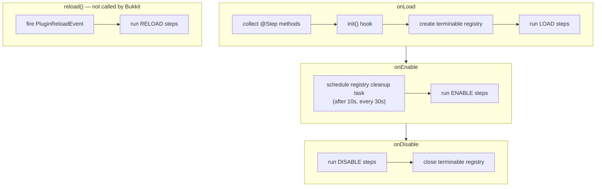

# Plugin Composition

The `plugin/` package (`common/src/main/java/me/wyne/wutils/common/plugin/`) is the
bootstrap layer a plugin built on WUtils extends its main class from. It gives you a
declarative way to order load/enable/disable/reload work into named **steps**, plus two
small pieces of infrastructure — `PluginUtils` and `LoggerWrapper` — that the rest of
`common/`, including the vendored [helper](helper.md) stack, depends on.

None of this package is vendored; all twelve files are first-party WUtils code.

## The step model

A **step** is a `PluginStep<T>` — one unit of work, tagged with a `StepScope` and an
integer priority, that runs against a plugin instance of type `T`.

`StepScope` (`common/src/main/java/me/wyne/wutils/common/plugin/StepScope.java:12-21`)
has four values:

- `LOAD` — runs during Bukkit's `onLoad()`.
- `ENABLE` — runs during Bukkit's `onEnable()`.
- `DISABLE` — runs during Bukkit's `onDisable()`.
- `RELOAD` — **never fired by Bukkit.** It only runs when a consumer explicitly calls
  the plugin's own `reload()` method, typically from a reload command.

At the top level (`CompositePlugin` or `CompositeJavaPlugin`), steps are filtered down
to those matching the scope being dispatched, then run in ascending priority order;
ties are broken by registration order, since the backing collection is an
insertion-ordered `LinkedHashSet` and the sort is stable
(`common/src/main/java/me/wyne/wutils/common/plugin/Step.java:24-30`).

## Step implementations

`PluginStep<T>` (`common/src/main/java/me/wyne/wutils/common/plugin/PluginStep.java:17`)
is a functional interface: implement `run(T plugin)` and you have a step. Its default
`getScope()`/`getPriority()`
(`common/src/main/java/me/wyne/wutils/common/plugin/PluginStep.java:28-33`) read the
`@Step` annotation off the *implementing class*, falling back to `ENABLE`/`0` when no
annotation is present.

**This is a trap for lambdas.** A `PluginStep<T>` written as a lambda expression is
backed by a synthetic class that can never carry an annotation, so it silently defaults
to `ENABLE` priority `0` regardless of what you intended. Use a named class with `@Step`,
an `AnnotationStep`, or wrap the lambda in a `ModifiedStep` when you need a different
scope or priority.

- **`AnnotationStep<T>`**
  (`common/src/main/java/me/wyne/wutils/common/plugin/AnnotationStep.java`) wraps a
  no-argument, `@Step`-annotated method and invokes it reflectively, forcing it
  accessible first (`AnnotationStep.java:38-46`). `CompositePlugin` and
  `CompositeJavaPlugin` build one of these automatically for every `@Step` method they
  find on the subclass, which is what lets you write a step as a plain annotated method
  instead of a standalone class.
- **`ModifiedStep<T>`**
  (`common/src/main/java/me/wyne/wutils/common/plugin/ModifiedStep.java:24-42`) decorates
  another step, overriding its scope and/or priority while delegating the actual work
  unchanged — useful for reusing an existing step under a different lifecycle phase
  without subclassing it.
- **`CompositeStep<T>`**
  (`common/src/main/java/me/wyne/wutils/common/plugin/CompositeStep.java`) groups several
  steps into one. The group carries its own scope and priority, used by whoever
  registers it to decide when the whole group runs.

### A trap in `CompositeStep`

`CompositeStep.run()`
(`common/src/main/java/me/wyne/wutils/common/plugin/CompositeStep.java:67-74`) runs
`before()`, then every child step in ascending priority order, then `after()` —
**unconditionally**. It does not filter children by their own declared scope; only the
top-level dispatch in `CompositePlugin`/`CompositeJavaPlugin` filters by scope. If you
nest a step declared with a different scope inside a `CompositeStep` registered under,
say, `ENABLE`, that child silently runs at `ENABLE` time regardless of what it declares.
Treat a `CompositeStep`'s scope as the scope for everything inside it, not as one more
filter layered on top of the children's own scopes. Subclasses that need to run
something immediately before or after the group override `before`/`after`
(`CompositeStep.java:57-65`) rather than `run`, which is `final`.

## Lifecycle: `CompositeJavaPlugin`

`CompositeJavaPlugin<T>`
(`common/src/main/java/me/wyne/wutils/common/plugin/CompositeJavaPlugin.java`) is the
class a WUtils-based plugin actually extends: `class MyPlugin extends
CompositeJavaPlugin<MyPlugin>`. It extends Bukkit's `JavaPlugin` and implements
`TerminableConsumer` (see [Vendored helper Library](helper.md) for `Terminable`/
`CompositeTerminable`), so it is both a real plugin main class and a terminable-bound
registry root.

- **`onLoad()`** (`CompositeJavaPlugin.java:60-66`) collects `@Step`-annotated methods
  into `AnnotationStep`s, calls the `init()` hook, creates the `CompositeTerminable`
  registry, then runs every `LOAD` step.
- **`onEnable()`** (`CompositeJavaPlugin.java:68-77`) schedules an async task that cleans
  up completed/cancelled bindings in the terminable registry — first run after 10
  seconds, repeating every 30 seconds, bound to the registry itself — then runs every
  `ENABLE` step.
- **`onDisable()`** (`CompositeJavaPlugin.java:79-83`) runs every `DISABLE` step
  **first**, and only afterward closes the terminable registry. This ordering matters:
  it means a disable step can still use resources bound via `bind`/`bindModule`, since
  those bindings are not yet closed while disable steps run.
- **`reload()`** (`CompositeJavaPlugin.java:85-92`) fires a `PluginReloadEvent` and then
  runs every `RELOAD` step. Bukkit never calls this; a consumer wires it to a reload
  command or similar.

All steps run against `(T) this` — the concrete plugin subtype, not
`CompositeJavaPlugin` itself.

`bind`/`bindModule` (`CompositeJavaPlugin.java:112-122`) delegate to the terminable
registry. **They are only safe to call after `onLoad()` has run** — the registry field
is `null` until `onLoad()` creates it, so calling either earlier throws a
`NullPointerException`.

## `CompositePlugin`: the wrapping alternative

`CompositePlugin<T>`
(`common/src/main/java/me/wyne/wutils/common/plugin/CompositePlugin.java`) gives the same
step pipeline (`onLoad`/`onEnable`/`onDisable`/`reload`, `CompositePlugin.java:65-89`) but
as a `Plugin` decorator around an existing plugin instance `T`, rather than a `JavaPlugin`
subclass. Every other `Plugin` method is delegated verbatim to the wrapped instance, and
steps run against that wrapped `T` (`CompositePlugin.java:102-107`) — not against the
`CompositePlugin` object itself.

Because it implements `Plugin` directly instead of extending `JavaPlugin`, Bukkit's
plugin loader cannot instantiate a `CompositePlugin` as a main class. The code implies
that whoever constructs one is expected to call its `onLoad()`, `onEnable()` and
`onDisable()` themselves, at the appropriate points in some other bootstrap. No consumer
of this class exists anywhere in the current repository, so treat that calling pattern
as what the shape of the code suggests rather than a confirmed, exercised design.

## `PluginReloadEvent`

A plain Bukkit `Event`
(`common/src/main/java/me/wyne/wutils/common/plugin/PluginReloadEvent.java:13-38`), fired
synchronously on the calling thread by both `CompositePlugin.reload()` and
`CompositeJavaPlugin.reload()`, just before their `RELOAD` steps run. It carries the
`Plugin` being reloaded via `getPlugin()`. Like `RELOAD` itself, Bukkit never fires this
on its own.

## `LoggerWrapper` and `LevelWrapper`

`LevelWrapper`
(`common/src/main/java/me/wyne/wutils/common/plugin/LevelWrapper.java:8-16`) is a 1:1
mirror of all eight log4j levels (`OFF`, `FATAL`, `ERROR`, `WARN`, `INFO`, `DEBUG`,
`TRACE`, `ALL`), least to most verbose, letting `LoggerWrapper`'s threshold be configured
without the caller depending on log4j types directly.

`LoggerWrapper`
(`common/src/main/java/me/wyne/wutils/common/plugin/LoggerWrapper.java`) wraps an slf4j
`Logger` and is meant to gate `trace`/`debug`/`info`/`warn`/`error` calls against that
threshold. **The gating is broken and inconsistent — read this before relying on it:**

- `trace(...)` and `debug(...)` do check `isTraceEnabled()`/`isDebugEnabled()`
  (`LoggerWrapper.java:61-66`, `:147-152`) before doing anything. But when enabled, they
  forward to the *wrapped logger's `info(...)` methods*, not its `trace`/`debug`
  methods. There is no way, through this class, to actually emit at `TRACE` or `DEBUG`
  level on the underlying logger.
- `info(...)`, `warn(...)` and `error(...)` (`LoggerWrapper.java:230-233` and the
  corresponding `warn`/`error` methods) are forwarded **unconditionally**, with no
  threshold check at all. `isInfoEnabled()`, `isWarnEnabled()` and `isErrorEnabled()`
  (`LoggerWrapper.java:226-228` and siblings) compute the threshold correctly, but
  nothing in the class calls them before logging.
- Every `Marker`-taking `isXEnabled(Marker)` override ignores the marker for the
  enablement check and just defers to the no-marker overload — e.g.
  `isTraceEnabled(Marker)` at `LoggerWrapper.java:99-102` is exactly
  `isTraceEnabled()`. The marker is still passed through to the wrapped logger when a
  message is actually logged.

**Net effect:** setting the threshold to `ERROR` (or anything else) suppresses nothing
except `trace`/`debug` calls, and those get relabeled as `info` on the wrapped logger
rather than actually silenced at the source. `info`/`warn`/`error` always go through.
Do not use `LoggerWrapper` to suppress `info`, `warn`, or `error` output — it cannot.

## `PluginUtils`

`PluginUtils`
(`common/src/main/java/me/wyne/wutils/common/plugin/PluginUtils.java`) is a small static
utility with four methods:

- **`getPlugin()`** (`common/src/main/java/me/wyne/wutils/common/plugin/PluginUtils.java:33-39`) caches
  `JavaPlugin.getProvidingPlugin(PluginUtils.class)` — the plugin whose classloader
  loaded this class — on first call.
- **`getLogger()`** (`common/src/main/java/me/wyne/wutils/common/plugin/PluginUtils.java:44-50`) caches `getPlugin().getSLF4JLogger()`.
- **`getServerVersion()`** (`common/src/main/java/me/wyne/wutils/common/plugin/PluginUtils.java:58-80`) parses `Bukkit.getBukkitVersion()`
  into a comparable integer combining major, minor and patch (`1.16.5` → `1165`), and
  caches it — but only on a *successful* parse. A failure returns `0` without caching,
  so a failed parse is retried on every subsequent call.
- **`setPlugin(Plugin)`** (`common/src/main/java/me/wyne/wutils/common/plugin/PluginUtils.java:85-87`) overrides the cached plugin
  reference directly, bypassing the classloader lookup.

`PluginUtils`'s static plugin reference is what the entire vendored helper stack — every
scheduled task, event subscription and promise continuation — resolves its owning
plugin through. See [Vendored helper Library](helper.md#why-the-plugin-lookup-is-the-thing-to-watch)
for what goes wrong when that reference doesn't point where you expect (shared
classloaders, calls before construction, and so on); this page only covers what
`PluginUtils` itself does.

## See also

- [WUtils Common](common.md) — module overview.
- [Vendored helper Library](helper.md) — `Terminable`/`CompositeTerminable`, and the
  full detail on how `PluginUtils` is wired into the vendored scheduler/event/promise
  code.
- [Events](events.md) — `EventRegistry`/`ListenerRegistry`, independent of this package.
- [Scheduler](scheduler.md) — `Scheduler` and the task types `CompositeJavaPlugin`'s
  registry cleanup task is built from.
- [Core Utilities](utilities.md) — other small standalone helpers in `common/`.
