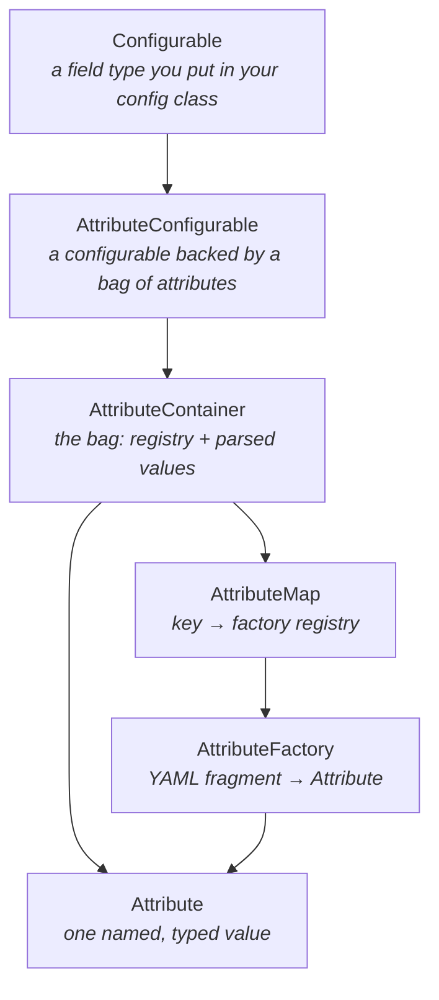

# WUtils Configurables

`configurables` is a library of **ready-made config shapes**. Where
[`config`](../config/config.md) gives you the machinery to generate and reload a YAML
file from annotated fields, this module gives you the *field types* to put in it: an
item, a GUI button, a message-and-sound interaction, a particle animation, a numeric
range, a cooldown.

You declare a field of one of these types, annotate it with `@ConfigEntry`, and a server
owner can then describe a whole custom item — material, name, lore, enchantments, potion
effects, attribute modifiers — in YAML, with no code change on your side.

- Directory: `configurables/`
- Gradle project: `:WUtils-configurables`
- Maven artifact: `io.github.wyne10:wutils-configurables`
- Version: `1.21.8` (`configurables/build.gradle:25`)
- Root package: `me.wyne.wutils.config.configurables` — note it sits *under* `config`'s
  package, not beside it

## Dependencies

| Dependency | Scope | Notes |
|---|---|---|
| `:WUtils-common` | `api` (transitive) | `ConfigUtils`, `Args`, ranges, comparators, operations, particle parsers. Consumers get it automatically. |
| `:WUtils-config` | `api` (transitive) | `ConfigEntry`, `ConfigBuilder`, the serializable interfaces. Consumers get it automatically. |
| `com.destroystokyo.paper:paper-api:1.16.5-R0.1-SNAPSHOT` | `compileOnly` | Used by nearly every class. Consumer supplies it. |
| `:WUtils-i18n` | `compileOnly` | **Required at runtime by items, interactions, animations and GUIs** — see below. Consumer supplies it. |
| `:WUtils-animation` | `compileOnly` | Only the animation configurables — see [Animations](animations.md). Consumer supplies it. |
| `dev.triumphteam:triumph-gui:3.1.13` | `compileOnly` | Only `GuiConfigurable` — see [GUIs](guis.md). Consumer supplies it. |
| `xyz.xenondevs.invui:invui:1.49` | `compileOnly` | Only `InvUiItemConfigurable` — see [GUIs](guis.md). Consumer supplies it. |

Source: `configurables/build.gradle:13-23`.

**i18n is not as optional as its scope suggests.** It is declared `compileOnly`, but
every text-bearing attribute resolves its string through `I18n.global` at apply time —
item names and lore, interaction messages, titles, commands, GUI click output. A
consumer who uses [Items](items.md) or [Interactions](interactions.md) without
[`wutils-i18n`](../i18n/i18n.md) on the runtime classpath gets a
`NoClassDefFoundError` the first time an item is built, not at load. The genuinely
optional dependencies are triumph-gui, InvUI and animation, each of which is confined to
its own configurable.

## The model

Four ideas, layered:

### Configurable

A *configurable* is any class implementing `config`'s
[`ConfigSerializable`/`ConfigDeserializable`](../config/serialization.md) pair: it can
render itself to generated YAML (`toConfig`) and read itself back from a live config
(`fromConfig`). That is the entire contract — `config` will call `fromConfig` on any
registered `@ConfigEntry` field whose current value implements `ConfigDeserializable`.

This module ships two families of them:

- **Value configurables** wrap one parsed value and nothing else — `IntRangeConfigurable`
  holds a `ClosedIntRange`, `TimeSpanConfigurable` holds a `TimeSpan`. They are thin, and
  they are covered in [Value Configurables](values.md).
- **Attribute configurables** are open-ended: they hold a *set* of independently parsed
  pieces, and which pieces are present is decided by the YAML, not by the class. Items,
  interactions, animation steps and GUI buttons are all of this kind.

### Attribute

An `Attribute<V>` (`configurables/src/main/java/me/wyne/wutils/config/configurables/attribute/Attribute.java:15-29`)
is a key/value pair and nothing more:

| Member | Meaning |
|---|---|
| `getKey()` | the YAML key this came from — `"material"`, `"message"`, `"delay"` |
| `getValue()` | the parsed value — a `Material`, a `List<String>`, a `long` |

The behaviour lives in the *interfaces an attribute also implements*. `MaterialAttribute`
is an `Attribute<Material>` that additionally implements `ItemStackAttribute`, so it
knows how to apply itself to an `ItemStack`. `MessageAttribute` is an
`Attribute<List<String>>` that implements `ContextInteractionAttribute`, so it knows how
to send itself to an `Audience`. The container never knows what any of this means; it
just holds attributes and hands out the ones matching a requested interface.

That indirection is the reason a single `ItemConfigurable` can grow twenty-four
independent optional features without twenty-four fields or a giant switch.

### AttributeFactory and AttributeMap

An `AttributeFactory<T>` turns a `(key, ConfigurationSection)` pair into an attribute
(`.../attribute/GenericFactory.java:17-19`). An `AttributeMap` is an ordered registry of
them (`.../attribute/AttributeMap.java:48-63`): YAML key → factory.

`AttributeMap.createAllMap(section)` (`.../attribute/AttributeMap.java:87-96`) is where
config becomes objects. It walks its registered keys, finds which of them the section
actually contains, and invokes the matching factory for each. Keys the YAML omits simply
produce no attribute — **absence is the mechanism for "leave this alone"**, which is why
none of the shipped attributes need a "disabled" flag.

Each attribute-backed configurable owns one `public static final AttributeMap` describing
its vocabulary: `ItemConfigurable.ITEM_ATTRIBUTE_MAP`,
`InteractionConfigurable.INTERACTION_ATTRIBUTE_MAP`,
`AnimationStepConfigurable.ANIMATION_STEP_ATTRIBUTE_MAP`,
`GuiConfigurable.GUI_ITEM_ATTRIBUTE_MAP`, `InvUiItemConfigurable.INV_UI_ITEM_ATTRIBUTE_MAP`.
These are mutable and public on purpose — registering your own factory into one is the
supported way to add a config key to every item in your plugin. See
[Attributes and Containers](attributes.md) for how to write one, and for the
class-initialisation ordering trap that comes with it.

### AttributeContainer

`AttributeContainer` (`.../attribute/AttributeContainer.java:29-138`) pairs an
`AttributeMap` with the `Map<String, Attribute<?>>` that parsing produced, and exposes
roughly forty lookup methods over it — by key or by class, returning the attribute, its
value, or a set of either. `AttributeConfigurable` delegates every one of them, so a
`ItemConfigurable` *is* a queryable bag of attributes.

There are two implementations: `ImmutableAttributeContainer`, whose `with`/`ignore`
return new containers, and `MutableAttributeContainer`, whose mutate in place. Every
shipped configurable uses the immutable one.

## The map

| Page | Covers |
|---|---|
| [Attributes and Containers](attributes.md) | the framework: attributes, factories, maps, containers, accessors, and how to add your own |
| [Value Configurables](values.md) | ranges, materials, sounds, time spans, comparators, operations, lists and maps |
| [Items](items.md) | `ItemConfigurable` and the twenty-four item attributes |
| [Interactions](interactions.md) | `InteractionConfigurable`: audiences, messages, titles, sounds, commands |
| [Animations](animations.md) | `AnimationConfigurable` and `AnimationStepConfigurable` |
| [GUIs](guis.md) | `GuiConfigurable` (triumph-gui) and `InvUiItemConfigurable` (InvUI) |

## See also

- [WUtils Config](../config/config.md) — the annotation and generation machinery these
  plug into, and [Serialization](../config/serialization.md) for the interfaces every
  configurable implements.
- [WUtils Common](../common/common.md) — `ConfigUtils` (the lenient typed reads every
  factory uses), [`Args`](../common/utilities.md), [Ranges](../common/ranges.md),
  [Comparators and Operations](../common/operations.md),
  [Particle Data Parsers](../common/particles.md).
- [WUtils Internationalization](../i18n/i18n.md) — how the text in these configs is
  interpreted.
