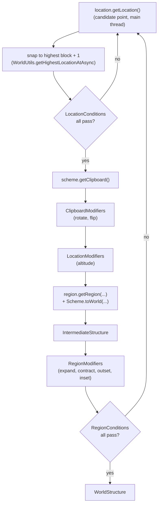

# WUtils Structure

`structure` places schematic-based structures in a Bukkit/Paper world: it
searches the world for a spot that satisfies config-declared conditions,
pastes a WorldEdit clipboard there, and protects the pasted area with a
WorldGuard region — all reversibly, so a structure can be torn down and the
original terrain restored.

Everything is driven from YAML. A `Structure` is the recipe you write in
config; running it produces a `WorldStructure`, the placed instance you
interact with at runtime.

- Directory: `structure/`
- Gradle project: `:WUtils-structure`
- Maven artifact: `io.github.wyne10:wutils-structure`
- Version: `1.2.7`
- Root package: `me.wyne.wutils.structure`

Source of these facts: `structure/build.gradle.kts`.

## Dependencies

| Dependency | Scope | Notes |
|---|---|---|
| `:WUtils-common` | `api` | Transitively available to consumers. Supplies scheduling (`Schedulers.sync()`), world/location helpers, ranges, comparators. |
| `:WUtils-configurables` | `api` | Transitively available to consumers. Supplies the `AttributeMap`/`AttributeConfigurable` machinery `Structure` uses to store and dispatch modifiers. |
| `com.sk89q.worldedit:worldedit-bukkit:7.2.17` | `compileOnlyApi` | **Consumer must supply this on the runtime classpath.** Every clipboard, region, and paste operation goes through WorldEdit. |
| `com.sk89q.worldguard:worldguard-bukkit:7.0.5` | `compileOnlyApi` | **Consumer must supply this too.** Protection regions, flags, and region conditions all require WorldGuard. |
| `com.destroystokyo.paper:paper-api:1.16.5-R0.1-SNAPSHOT` | `compileOnly` | Consumer must supply a Paper (or Paper-fork) runtime. |
| `org.javatuples:javatuples:1.2` | `implementation` | Lands in the published POM at runtime scope, so consumers get it automatically; used internally to pair a resolved WorldGuard flag with its parsed value. |

`compileOnlyApi` means both WorldEdit and WorldGuard are re-exposed to
consumers at compile time but never bundled — a consumer that omits either
one at runtime will hit `NoClassDefFoundError` the first time this module's
code path is exercised, not at build time.

`structure/persistence` serializes to JSON via Gson, but Gson is not
declared anywhere in `structure/build.gradle.kts`. It arrives transitively
through `worldedit-bukkit`'s own dependencies — anything able to compile
against WorldEdit already has Gson on the classpath. See
[Persistence](persistence.md).

## The pipeline

A `Structure` (`structure/src/main/java/me/wyne/wutils/structure/Structure.java`)
only describes the recipe — it holds no world state. It reads a key plus
five sections from YAML: `location`, `scheme`, `region`, `conditions`
(location and region conditions share this one section), and `modifiers`:

<!-- allow-code-fences -->
```yaml
my-structure:           # section name doubles as the default key
  key: my-structure     # optional; defaults to the section name
  location: { ... }     # see locations.md
  scheme: { ... }       # see schemes.md
  region: { ... }       # see regions.md
  conditions: { ... }   # location AND region conditions, interleaved freely
  modifiers: { ... }    # see modifiers.md and edit-modifiers.md
```

`Structure.fromConfig` (`structure/src/main/java/me/wyne/wutils/structure/Structure.java:204-223`)
reads all six via each package's own `Factory`. Calling
`Structure#create(long, StructureCancellationToken, Executor)`
(`structure/src/main/java/me/wyne/wutils/structure/Structure.java:240`) runs
the recipe and resolves to a `WorldStructure` — placed, but not yet spawned.

Generation happens in two phases, both retried together as one unit:



**Phase 1 — location and clipboard**
(`getIntermediateStructure`, `structure/src/main/java/me/wyne/wutils/structure/Structure.java:268-305`).
The `StructureLocation` yields a candidate point; the caller snaps it to the
highest solid block (`+1`) and checks every `LocationCondition`
(see [Locations and Conditions](locations.md)). Any failure restarts the
whole attempt from a fresh candidate location. Once a location survives, the
`Scheme` supplies the clipboard, `ClipboardModifier`s pick the paste
transform (rotation/flip), `LocationModifier`s adjust the final placement
point, and `StructureRegion` builds the pre-modifier WorldGuard region shape
(see [Schemes and Clipboards](schemes.md) and
[Regions and Flags](regions.md)). The result is an `IntermediateStructure`
(`structure/src/main/java/me/wyne/wutils/structure/IntermediateStructure.java:20-27`) —
a snapshot of everything resolved so far.

**Phase 2 — region and conditions**
(`createWorldStructure`, `structure/src/main/java/me/wyne/wutils/structure/Structure.java:244-266`).
`RegionModifier`s (expand/contract/outset/inset) reshape the protected
region, then every `RegionCondition` is checked against the *final* shape.
Failing any of them restarts from Phase 1 — not just the region step —
because the next attempt needs a fresh location too. Passing yields the
`WorldStructure`.

All six modifier kinds — `ClipboardModifier`, `LocationModifier`,
`RegionModifier`, and the three applied later during `spawn()`
(`SnapshotModifier`, `PasteModifier`, `EditSessionModifier`) — are detailed
in [Modifiers](modifiers.md) and [Terrain Edit Modifiers](edit-modifiers.md).

### Spawning

`WorldStructure#spawn()`
(`structure/src/main/java/me/wyne/wutils/structure/WorldStructure.java:93-102`)
snapshots the target region (with `SnapshotModifier`s applied to the copy
operation), pastes the clipboard (with `PasteModifier`s applied to the
paste builder), runs any `EditSessionModifier`s on a fresh `EditSession`
around the pasted footprint, and registers the WorldGuard region. If
pasting or region registration throws, the pre-spawn snapshot is restored
before the exception propagates, so a failed spawn leaves the world
unchanged. Individual `SnapshotModifier`, `PasteModifier`, and
`EditSessionModifier` instances that throw are logged and skipped rather
than aborting the whole spawn — one misbehaving modifier does not sink the
others.

### `AutoCloseable`

`WorldStructure` implements `AutoCloseable`
(`structure/src/main/java/me/wyne/wutils/structure/WorldStructure.java:49`).
`close()` (`structure/src/main/java/me/wyne/wutils/structure/WorldStructure.java:268-272`)
unregisters the WorldGuard region and repastes the pre-spawn snapshot,
undoing the spawn. This makes try-with-resources a working pattern for a
temporary structure: it is placed on entry and rolled back on exit.

### Threading

Location lookup hops onto the main thread via `Schedulers#sync()`
(`structure/src/main/java/me/wyne/wutils/structure/Structure.java:273`)
because it queries world height and, for `BiomeLocation`/
`NearestStructureLocation`, calls `World#locateNearestBiome` /
`World#locateNearestStructure` — both of which Bukkit requires on the main
thread. Everything else — clipboard modifiers, region building, condition
checks, and the retry loop itself — runs on the `Executor` the caller
passes to `create(...)`. `WorldStructure#spawn()` and `#close()` are not
scheduled by this module at all; the caller is responsible for invoking
them on a thread WorldEdit/WorldGuard accept (in practice, the main thread).

### Cancellation and timeouts

`create(long timeoutMillis, StructureCancellationToken token, Executor executor)`
(`structure/src/main/java/me/wyne/wutils/structure/Structure.java:240`)
takes a total time budget, measured from the first call across every retry,
and an optional `StructureCancellationToken`
(`structure/src/main/java/me/wyne/wutils/structure/StructureCancellationToken.java:11-23`) —
a thread-safe cancellation flag. Cancelling the token before or during
generation fails the returned future with `CancellationException`
(`structure/src/main/java/me/wyne/wutils/structure/Structure.java:270`).
Running out of the time budget instead fails it with `IllegalStateException`
(`structure/src/main/java/me/wyne/wutils/structure/Structure.java:272`) —
distinct exception types, so callers can tell "gave up on time" from
"someone cancelled it" without inspecting the message.

## Package inventory

| Package | Contents | Page |
|---|---|---|
| `me.wyne.wutils.structure` | `Structure`, `WorldStructure`, `IntermediateStructure`, `StructureCancellationToken` | this page |
| `me.wyne.wutils.structure.scheme` | `Scheme`, `FileScheme`, `RandomScheme`, `ClipboardScan`, `ClipboardScanCache` | [Schemes and Clipboards](schemes.md) |
| `me.wyne.wutils.structure.location` | `StructureLocation`, `BiomeLocation`, `NearestStructureLocation`, `RandomLocation`, `SetLocation` | [Locations and Conditions](locations.md) |
| `me.wyne.wutils.structure.location.condition` | `LocationCondition` and its implementations | [Locations and Conditions](locations.md) |
| `me.wyne.wutils.structure.region` | `StructureRegion`, `MarginRegion`, `SchemeRegion`, `RegionData` | [Regions and Flags](regions.md) |
| `me.wyne.wutils.structure.region.condition` | `RegionCondition` and its implementations | [Regions and Flags](regions.md) |
| `me.wyne.wutils.structure.persistence` | `WorldStructureMemento`, `WorldStructureMementoSerializer`, `WorldStructurePersistence` | [Persistence](persistence.md) |
| `me.wyne.wutils.structure.modifier` (+ `.clipboard`, `.location`, `.region`) | `StructureModifier` key registry, `ClipboardModifier`, `LocationModifier`, `RegionModifier`, `SnapshotModifier`, `PasteModifier`, `EditSessionModifier`, and the non-edit implementations | [Modifiers](modifiers.md) |
| `me.wyne.wutils.structure.modifier.edit` | The `EditSessionModifier` implementations (replace, set, grow, smooth, biome, deform, snow, thaw, …) | [Terrain Edit Modifiers](edit-modifiers.md) |
| `me.wyne.wutils.structure.mask`, `me.wyne.wutils.structure.pattern` | `LazyMask`/`MaskUtils` and `LazyPattern`/`PatternUtils` — small helpers the modifier packages build masks and patterns from | referenced in [Modifiers](modifiers.md) |

## The `Structure.Builder`

For placing structures without a config file, `Structure.builder()`
(`structure/src/main/java/me/wyne/wutils/structure/Structure.java:160-163`)
gives a fluent, programmatic alternative to YAML. `key`, `location`,
`scheme`, and `region` are required; `build()`
(`structure/src/main/java/me/wyne/wutils/structure/Structure.java:434-458`)
throws `NullPointerException` if any is missing.

`build()` also re-sorts whatever modifiers were added via `.modifier(...)`
into `STRUCTURE_MODIFIER_MAP`'s registration order
(`structure/src/main/java/me/wyne/wutils/structure/Structure.java:92-128`) —
the same canonical order YAML keys are matched against. Any modifier key
`build()` doesn't recognize (a custom, non-built-in modifier) is appended
afterward, in the order it was added. `Structure.builder(Structure source)`
/ `toBuilder()` seed a builder from an existing `Structure`, useful for
producing variants of one recipe.

## See also

- [Schemes and Clipboards](schemes.md)
- [Locations and Conditions](locations.md)
- [Regions and Flags](regions.md)
- [Persistence](persistence.md)
- [Modifiers](modifiers.md)
- [Terrain Edit Modifiers](edit-modifiers.md)
- [WUtils Configurables](../configurables/configurables.md) — `AttributeMap`/`AttributeConfigurable`, the config-attribute machinery `Structure` and `StructureRegion` build on.
- [Scheduler](../common/scheduler.md) — `Schedulers.sync()`.
