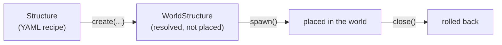

# Structures

`wutils-structure` places schematic-based structures in a Bukkit/Paper world: it searches
for a spot that satisfies conditions you configure, pastes a WorldEdit clipboard there,
and protects the pasted area with a WorldGuard region — reversibly, so you can tear a
structure back down and restore the original terrain. Reach for it for anything you want
generated procedurally into an existing world (loot rooms, random dungeons, world-gen
add-ons); for a structure you place by hand once and never move, plain WorldEdit/
WorldGuard is simpler.

Everything is driven from YAML. You write a `Structure` recipe in config; running it
produces a `WorldStructure`, the placed instance you interact with at runtime.

**This module requires both WorldEdit and WorldGuard.** Neither is optional — every
clipboard, region, mask, and pattern operation goes through one or the other, and a
consumer missing either one hits a runtime `NoClassDefFoundError`, not a build failure,
the first time a structure is generated.

## Adding it to your build

```kotlin
dependencies {
    implementation("io.github.wyne10:wutils-structure:1.2.7")
}
```

| Dependency | Scope | Notes |
|---|---|---|
| WorldEdit (`worldedit-bukkit` 7.2.17+) | `compileOnlyApi` — **you must supply this** | clipboards, regions, pastes, masks, patterns |
| WorldGuard (`worldguard-bukkit` 7.0.5+) | `compileOnlyApi` — **you must supply this** | protection regions, flags, region conditions |
| Paper API 1.16.5 | `compileOnly` | consumer supplies a Paper (or Paper-fork) runtime |

`wutils-common` and `wutils-configurables` come along transitively — you don't add them
yourself. Gson (needed for [persistence](#surviving-a-restart)) arrives transitively
through WorldEdit's own dependencies; you don't declare it either.

## The two-phase model

A `Structure` only describes the recipe — it holds no world state by itself. Calling
`create(...)` on it searches for a valid placement and, once found, yields a
`WorldStructure`: a resolved but not-yet-placed instance. Calling `spawn()` on that
actually pastes the clipboard and registers the protection region. Calling `close()`
reverses `spawn()` — it unregisters the region and repastes whatever was there before,
undoing the placement.



Because `close()` cleanly undoes `spawn()`, try-with-resources is a working pattern for a
temporary structure — it's placed on entry and rolled back on exit:

```java
try (WorldStructure worldStructure = structure.create(5000, null, ForkJoinPool.commonPool())
        .get()) {
    worldStructure.spawn();
    // ... the structure exists in the world for the rest of this block ...
} // close() runs automatically here: region unregistered, terrain restored
```

(`.get()` blocks the calling thread and throws the checked `InterruptedException`/
`ExecutionException` — fine to block on off the main thread, not on it; prefer
`.thenAccept(...)` as in the example below when you're already on the main thread.)

For a structure meant to persist, don't use try-with-resources — hold onto the
`WorldStructure` (or [persist it](#surviving-a-restart)) and call `close()` only when you
actually want it removed.

## A complete example

```yaml
goblin-camp:
  location:
    world: world
    range: "-2000..2000, 0..255, -2000..2000"
    except: "-100..100, 0..255, -100..100"   # never land near spawn
  scheme:
    schemes: schematics/goblin-camp-.*\.schem  # picks one at random matching this regex
  region:
    id: goblin-camp-<x>x<y>y<z>z
    margin: 4
    flags:
      pvp: allow
      mob-spawning: allow
  conditions:
    is-in-biome: [FOREST, PLAINS]
    is-not-on-block: [WATER, LAVA]
    altitude: ">=60"
    altitude-difference: "<=6"          # reject overly uneven terrain
  modifiers:
    rotate: any                          # random 90-degree rotation each placement
    outset: 6 -h                          # grow the protected region 6 blocks, horizontal only
    smooth: 8 2                            # smooth an 8-block ring around it, 2 passes
    snapshotEntities: true                  # rollback restores entities too
    pasteEntities: true                      # paste copies entities baked into the schematic
```

Loading and running it:

```java
ConfigurationSection section = config.getConfigurationSection("structures.goblin-camp");
Structure structure = new Structure(section);

structure.create(10_000, null, ForkJoinPool.commonPool())
        .thenAccept(worldStructure -> Bukkit.getScheduler().runTask(plugin, worldStructure::spawn))
        .exceptionally(ex -> {
            plugin.getLogger().warning("Could not place goblin-camp: " + ex.getMessage());
            return null;
        });
```

`create(...)` runs the search off the main thread except for the parts Bukkit requires on
it (world height and biome/structure lookups); `spawn()` and `close()` are **not**
scheduled by this module at all — always call them yourself on the main thread, since
WorldEdit/WorldGuard expect that.

The `10_000` is a total millisecond budget across every retry, not per attempt — running
out fails the future with `IllegalStateException`. Pass a `StructureCancellationToken`
instead of `null` if you want to be able to cancel a long-running search yourself; a
cancelled token fails the future with `CancellationException` instead, so you can tell the
two failure modes apart.

## Location strategies

Which strategy you get is decided by which config keys are present under `location:`,
checked in this order — the first match wins:

| Keys present | Strategy | What it does |
|---|---|---|
| `near-biome` / `far-biome` / `biome-preset` | `BiomeLocation` | Finds a point near (or far from) a biome or named biome group |
| `near-structure` / `far-structure` | `NearestStructureLocation` | Finds a point near (or far from) a vanilla structure |
| `range` | `RandomLocation` | Uniform random point inside a volume, optionally excluding a sub-volume via `except` |
| (none of the above) | `SetLocation` | A single fixed coordinate — no search at all |

`world`, `range`, and `except` apply to all three dynamic strategies (`BiomeLocation` and
`NearestStructureLocation` both search from a `RandomLocation` internally), not just
`RandomLocation` on its own. A candidate location is never trusted as final — it's
snapped to the highest solid block and checked against every condition before being used.

## Conditions

Conditions live in one shared `conditions:` section and can be freely interleaved —
location conditions are checked right after a candidate location is found; region
conditions are checked after region modifiers have reshaped the protected region, so they
see its *final* shape, margin/expansion included.

| Config key | Checks | Stage |
|---|---|---|
| `is-in-biome` / `is-not-in-biome` | biome name list | location |
| `is-in-biome-preset` / `is-not-in-biome-preset` | named biome group | location |
| `is-on-block` / `is-not-on-block` | material of the block **one below** the candidate | location |
| `is-in-ocean` | ocean biome | location |
| `is-in-mountains` | mountain/hill-family biome | location |
| `altitude` | comparator on Y, e.g. `">=64"` | location |
| `temperature` | comparator on biome temperature, e.g. `"<0.5"` | location |
| `region-whitelist` | every WorldGuard region overlapping the candidate must be on this list | region |
| `altitude-difference` | comparator on terrain height variance under the footprint, e.g. `"<=8"` | region |

Failing any condition — location or region — restarts the whole search from a fresh
candidate location, not just the failed step.

## The modifier pipeline

Modifiers are config-driven hooks that run at fixed points regardless of what order you
write them in YAML — see [the surprise below](#registration-order-not-yaml-order). Six
interfaces cover the whole pipeline:

| Stage | Interface | Runs | Does |
|---|---|---|---|
| 1 | `ClipboardModifier` | before location/region are computed | Picks the paste rotation/flip |
| 2 | `LocationModifier` | after the highest-block lookup | Nudges the placement Y (or point) |
| 3 | `RegionModifier` | before region conditions | Reshapes the protected region (expand/contract/outset/inset) |
| 4 | `SnapshotModifier` | during `spawn()`, before the rollback snapshot | Configures what the pre-paste snapshot captures |
| 5 | `PasteModifier` | during `spawn()`, after the snapshot | Configures the paste itself (entities, biomes, masks) |
| 6 | `EditSessionModifier` | during `spawn()`, after the paste | Edits terrain around the pasted structure |

Stages 1–3 run inside `create(...)`: if one throws, the whole placement attempt aborts.
Stages 4–6 run inside `spawn()`: if one throws, it's logged and skipped — one bad modifier
doesn't sink the paste or the others.

### All modifier keys

| Config key | Modifier | Value | Stage |
|---|---|---|---|
| `rotate` | rotation | angles (`90 180`) or `any`/`random`/`true` for all four | 1 |
| `flip` | mirroring | axes (`x z`) or `any`/`random`/`true` | 1 |
| `altitude` | Y offset | an [`IntOperation`](../../dev/common/operations.md) string, e.g. `+2` | 2 |
| `expand` / `contract` | grow/shrink one face | `<direction> <amount>` | 3 |
| `outset` / `inset` | grow/shrink all faces | `<amount> [-h] [-v]` | 3 |
| `snapshotEntities` / `snapshotBiomes` | what the rollback snapshot captures | boolean | 4 |
| `snapshotRemoveEntities` | whether taking the snapshot removes entities from the source | boolean | 4 |
| `snapshotSourceMask` | restrict the snapshot to matching blocks | mask string | 4 |
| `pasteEntities` / `pasteBiomes` | what the paste copies from the clipboard | boolean | 5 |
| `pasteIgnoreAir` | skip clipboard air blocks | boolean | 5 |
| `pasteSourceMask` | restrict the paste to matching clipboard blocks | mask string | 5 |
| `replace` | replace blocks matching a mask with a pattern | `mask pattern` | 6 |
| `set` | set a pattern across the pasted region | `mask pattern` | 6 |
| `grow` | blend terrain height toward a target level | `margin(5) strength(2) base(+0) [direction] [mask]` | 6 |
| `smooth` | Gaussian-smooth terrain height | `margin(5) iterations(1) [mask]` | 6 |
| `naturalize` | re-layer grass/dirt/stone | `radius` | 6 |
| `flora` | scatter flora | `margin(0) density(5) includeClipboard(false)` | 6 |
| `forest` | grow trees | `margin(0) treeType density(5) includeClipboard(false)` | 6 |
| `biome` | set the biome around the structure | `margin(0) biomeId` | 6 |
| `deform` | apply a WorldEdit deform expression | `margin expression` | 6 |
| `snow` / `snowIfCold` | simulate snowfall (optionally only in cold biomes) | `radius` | 6 |
| `adaptSurface` | replace surface blocks with the surrounding area's most common block | `margin(4) mask sampleMask` | 6 |
| `thaw` | melt snow/ice | `radius` | 6 |
| `green` | convert dirt to grass | `radius` | 6 |
| `ex` | extinguish fire | `radius` | 6 |
| `butcher` | remove non-player, non-decorative entities | `radius` | 6 |
| `deltree` | remove floating trees | `margin(0) includeClipboard(false)` | 6 |
| `dropFloating` | remove now-unsupported plants/blocks | `margin(0) includeClipboard(false)` | 6 |

Full grammar for each key — including the `RegionRadiusEditModifier`/`MarginEditModifier`
distinction and every settings parser's exact token order — is in the contributor wiki's
[Modifiers](../../dev/structure/modifiers.md) and
[Terrain Edit Modifiers](../../dev/structure/edit-modifiers.md) pages.

## Two things that will surprise you

**Registration order is application order, regardless of YAML key order.** Modifiers
always run in a fixed internal order — the one in the tables above — no matter what order
you write them under `modifiers:` in your file. Writing `smooth` before `rotate` in your
YAML does not make smoothing happen first; rotation (stage 1) always happens before any
terrain edit (stage 6).

**13 of the 18 terrain-edit modifiers silently grow your WorldGuard region.** Adding
`smooth: 8 2` (or `grow`, `naturalize`, `flora`, `forest`, `biome`, `deform`, `snow`,
`snowIfCold`, `thaw`, `green`, `deltree`, `dropFloating`) to a structure doesn't just edit
terrain — it also expands the protected region to cover the area it edited, the same way
`outset` would. Only `replace`, `set`, `adaptSurface`, `ex`, and `butcher` leave the region
untouched. If your protection region ends up bigger than your `region:` section implies,
check whether one of these is why.

## Surviving a restart

A spawned `WorldStructure` only holds its clipboard and rollback snapshot in memory — on
a server restart, that state is gone even though the structure is still pasted in the
world, and there is no clean way to `close()` it anymore. `WorldStructurePersistence`
writes a spawned structure's full state (as JSON plus two `.schem` files) to disk so it
survives:

```java
WorldStructurePersistence persistence = new WorldStructurePersistence(schematicDirectory);

persistence.save(new File(dataFolder, "goblin-camp.json"), worldStructure); // after spawn()

// ... later, after the target world has finished loading on the next startup ...
WorldStructure restored = persistence.load(new File(dataFolder, "goblin-camp.json"));
restored.close(); // rolls it back exactly as if it had never left memory
```

Both `save(...)` and `load(...)` declare `throws IOException` — wrap or propagate as your
own plugin's error handling expects.

`load(...)` does **not** re-spawn the structure — the paste already exists in the world
from before the restart — it only gives you back a handle you can `close()`. See the
contributor wiki's [Persistence](../../dev/structure/persistence.md) page for the memento
format and the two schematic files it writes.

## See also

- [the contributor wiki](../../dev/structure/structure.md) — the full generation
  pipeline, threading rules, and the programmatic `Structure.Builder`.
- [Schemes and Clipboards](../../dev/structure/schemes.md) — how `scheme`/`schemes`
  resolve to a clipboard, including the directory-plus-regex gotcha in `schemes`.
- [Locations and Conditions](../../dev/structure/locations.md) — every location
  strategy's exact search algorithm, including `RandomLocation`'s infinite-loop hazard if
  `except` covers all of `range`.
- [Regions and Flags](../../dev/structure/regions.md) — `RegionData`, WorldGuard flag
  resolution, and region id sanitization.
- [Modifiers](../../dev/structure/modifiers.md) and
  [Terrain Edit Modifiers](../../dev/structure/edit-modifiers.md) — full grammar for every
  modifier key in the tables above.
- [Configurables](../configurables/configurables.md) — the `AttributeMap`/
  `AttributeConfigurable` machinery `Structure` and its modifiers are built on.
